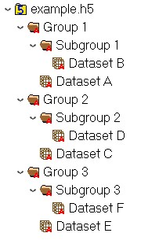

--- 
title: "Moberg Analytics HDF5 Documentation"
author: "Author: Zack Goldblum - Moberg Analytics"
site: bookdown::bookdown_site
output: 
  bookdown::gitbook:
    number_sections: false
header-includes:
    - \usepackage[labelformat=empty]{caption}
documentclass: book
bibliography: [book.bib, packages.bib]
biblio-style: apalike
link-citations: yes
github-repo: rstudio/bookdown-demo
description: "This is the Moberg Analytics HDF5 documentation. The output format for this example is bookdown::gitbook."
---

# Overview

This documentation details how to use the functions available in the [Moberg-Analytics-HDF5 package](https://test.pypi.org/project/Moberg-Analytics-HDF5/). The Moberg-Analytics-HDF5 package provides user-friendly functions organized into classes for reading HDF5 file content and components into Python. It is built on top of the [h5py package](https://www.h5py.org/) which interfaces directly with the HDF5 file.

The three **HDF5Content**, **HDF5Components**, and **HDF5Helper** sections in the left-hand navigation bar correspond to the three classes within the hdf5_tools module: 

- **HDF5Content** contains functions that organize the contents of the HDF5 file into lists and dictionaries.

- **HDF5Components** contains functions that return various components of the HDF5 file to the user including groups, datasets, Pandas/NumPy matrices of dataset values, metadata, and structured dictionaries.

- **HDF5Helper** contains functions for argument, group, dataset, and duplicate checks as well as other methods that add functionality to HDF5Content and HDF5Components.

Each class section is further divided into **Group Functions**, **Dataset Functions**, and **Misc. Functions** sections that contain the relevant functions for working with groups, datasets, and other aspects of the HDF5 file. Every function has a description that details what it does, the parameters it accepts (if any), and what it returns. There are also code examples that demonstrate how the function is called and show what it returns. All of the code examples use the example.h5 HDF5 file, the structure of which is shown below.

## Example HDF5 File Structure



## Revision History

```{r, echo=FALSE, results='hide'}
dataframe <- data.frame(
  rev_date = c("01/08/2021", "03/05/2021"),
  rev_num = c("1.0", "2.0"),
  rev_desc = c("Documentation created.", "Updated for package release.")
)
print(dataframe)
```

```{r table, tidy=FALSE, echo=FALSE}
knitr::kable(dataframe, format="html",
             col.names = c("Date", "Revision Number", "Description"),
             booktabs = TRUE)
```
