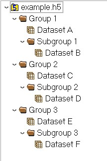

--- 
title: "HDF5 Import API Documentation"
author: "Zack Goldblum - Moberg Analytics"
#date: "Revision 0.1 - 01/08/2020"
site: bookdown::bookdown_site
output: 
  bookdown::gitbook:
    number_sections: false
documentclass: book
bibliography: [book.bib, packages.bib]
biblio-style: apalike
link-citations: yes
github-repo: rstudio/bookdown-demo
description: "This is a minimal example of using the bookdown package to write a book. The output format for this example is bookdown::gitbook."
---

# Overview

[Insert a text description that gives an overview of what this API is, how it's used, how the documentation is setup, etc.]

```{r, echo=FALSE, results='hide'}
dataframe <- data.frame(
  rev_date = c("01/08/2021"),
  rev_num = c(0.1),
  rev_desc = c("Initial test")
)
print(dataframe)
```

```{r rev-table, tidy=FALSE, echo=FALSE}
knitr::kable(dataframe, format="html",
             col.names = c("Date", "Revision Number", "Description"),
             caption = "Revision History",
             booktabs = TRUE)
```

## Example HDF5 File Structure



